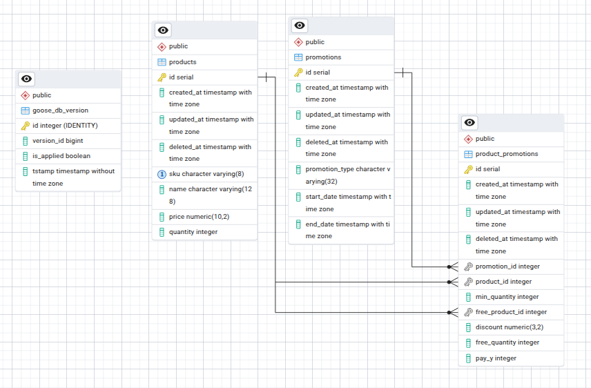

# Database Design

## Tables Overview
1. **products**

Stores information about available products.

- id (serial, PK) -> Unique identifier for each product.

- created_at, updated_at, deleted_at -> Timestamps for lifecycle management (soft delete supported via deleted_at).

- sku (varchar(8)) -> Stock Keeping Unit, a short unique code.

- name (varchar(128)) -> Product name.

- price (numeric(10,2)) -> Price of the product (two decimal precision).

- quantity (integer) -> Current stock/quantity available.
------------------------------

2. **promotions**

Stores information about active/inactive promotions.

- id (serial, PK) -> Unique identifier for each promotion.

- created_at, updated_at, deleted_at -> Timestamps for lifecycle management.

- promotion_type (varchar(32)) -> Type of promotion (e.g., "FREE_ITEM", "BUY_X_PAY_Y", "BULK_DISCOUNT").

- start_date, end_date (timestamp with time zone) -> Validity period of the promotion.
------------------------------

3. **product_promotions**

A junction/association table that links products and promotions.
This allows promotions to be applied to multiple products, with specific rules.

- id (serial, PK) -> Unique identifier.

- created_at, updated_at, deleted_at -> Timestamps for lifecycle.

- promotion_id (FK -> promotions.id) -> The promotion being applied.

- product_id (FK -> products.id) -> The product receiving the promotion.

- min_quantity (integer) -> Minimum quantity needed to qualify (e.g., "buy 3 to get discount").

- free_product_id (FK -> products.id) -> Another product given for free (used in "FREE_ITEM" promotion type).

- discount (numeric(3,2)) -> Percentage discount in decimal (e.g., 0.10 = 10% off, used in "BULK_DISCOUNT" promotion type).

- free_quantity (integer) -> Number of free items given (used in "FREE_ITEM" promotion type).

- pay_y (integer) -> Used in "buy X, pay for Y" promotion type (e.g., buy 3 for the price of 2).

------------------------------

4. **goose_db_version**
used by goose migration tool

------------------------------

**RELATIONSHIPS**

One-to-many (products -> product_promotions): A product can be tied to multiple promotions.

One-to-many (promotions -> product_promotions): A promotion can apply to multiple products.